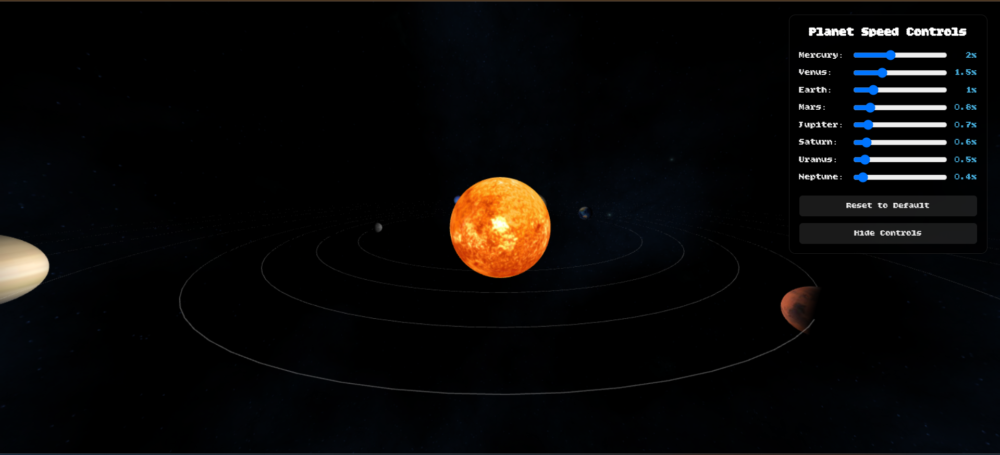

# 3D Solar System Simulation with Three.js

<p align="center">
  
</p>

A responsive 3D simulation of our solar system built with Three.js, featuring realistic planet orbits and interactive speed controls.

## Features

- 3D rendering of the Sun and all 8 planets
- Realistic orbital paths and rotations
- Interactive speed controls for each planet
- Mobile-responsive design
- Smooth animations using Three.js

## Live Demo

Access the live version at: [vist 3D SOLAR SYSTEM ](https://3-d-s-ol-ar.vercel.app/)

## 🛠️ Technologies Used
**Frontend**: HTML5, CSS3, JavaScript
- **Icons**: Font Awesome
- **Fonts**: Google Fonts (Bitcount Grid Double)
- **Animations**: THREE.JS
## 🚀 Project Structure

```
3DSOLAR/
├── index.html          # Main HTML file
├── styles.css          # All CSS styles
├── JS
├    ├── main.js          # JavaScript 
├── image                  #all image    
└── README.md          # Project documentation
```

## 🔧 Setup Instructions

### Option 1: Local Setup

1. Clone the repository or download the files
2. Open `index.html` in your browser
3. No server required - works directly from file system


## 📱 Responsive Design

The application features responsive breakpoints for:

1. **Desktop**: Full layout with all components
2. **Tablet**: Adjusted spacing and sizing
3. **Mobile**:
   - Hamburger menu navigation
   - Simplified form elements
   - Optimized touch targets
   ## 🤝 Contributing

Contributions are welcome! Please follow these steps:

1. Fork the repository
2. Create a feature branch
3. Commit your changes
4. Push to the branch
5. Create a Pull Request


---

**Happy 3D SOLAR SYSTEM!** 🚀